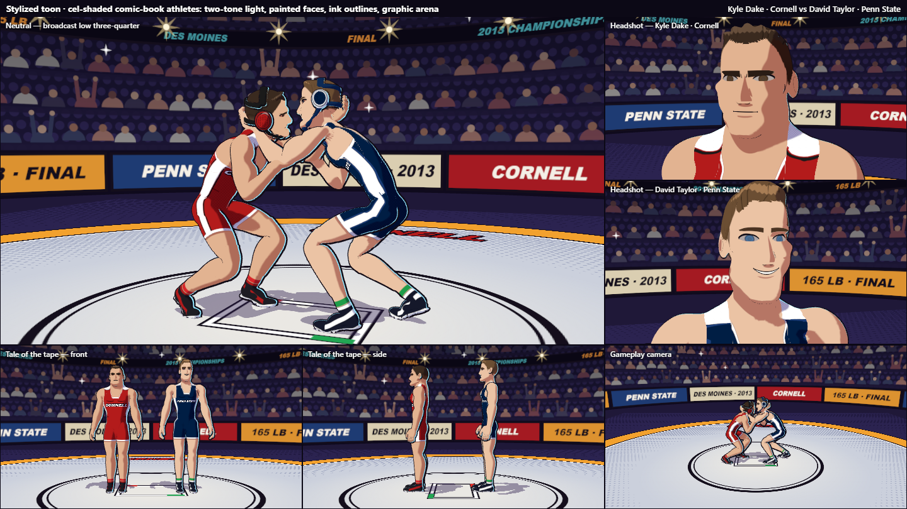
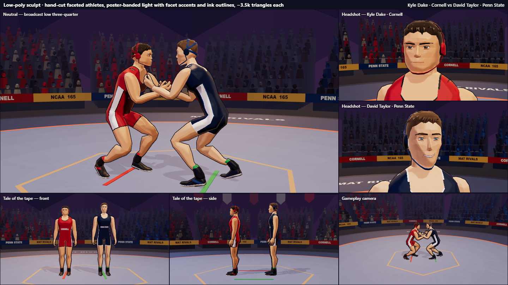
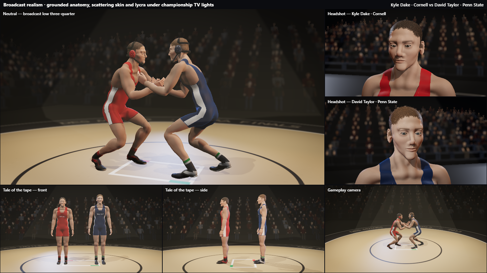
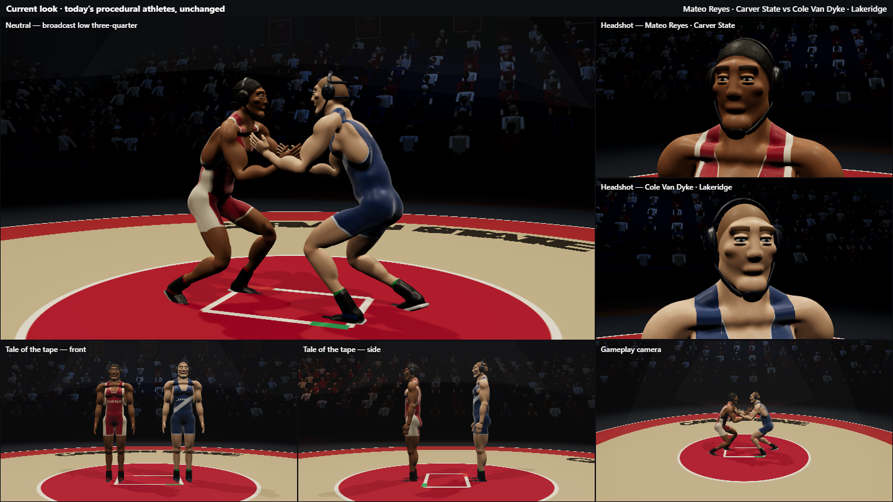

# Character art-direction mockups

Three candidate art styles for Mat Rivals' wrestlers, plus today's look for reference. They
were made to choose a direction after the owner found the current characters unappealing,
with odd body types. **No direction has been chosen yet. The shipped game is unchanged.**

Every mockup shows the same two real wrestlers: Kyle Dake (Cornell) vs David Taylor (Penn
State), from the 2013 NCAA Division I final at 165 lb, which Dake won 5–4. The owner chose to
use real wrestlers and is fine with them being public. The likenesses come from written
descriptions, not photos.

- **Open [`index.html`](index.html)** for the comparison page. It works straight from disk or on
  any static host; the "live" links on it need the dev server.
- On GitHub, this README shows the same screenshots inline.

## The styles

Scores are out of 10, from an independent art-director review on 2026-10-03.

| Style | Folder | Score | In short |
| --- | --- | --- | --- |
| Stylized toon | `src/lab/styles/cartoon/` | 7.5 | Cel-shaded comic look with ink outlines. The most appealing; Dake's face needs work. |
| Low-poly sculpt | `src/lab/styles/lowpoly/` | 7 | Faceted, ~3.7k triangles per body, best for phones; slightly less polished. |
| Broadcast realism | `src/lab/styles/realistic/` | 3.5 | Good bodies at match distance; close-up faces are uncanny. Would need an artist-made base head. |
| Current look | `src/lab/styles/current/` | — | Today's characters in the game's arena, unchanged. |

### Stylized toon


### Low-poly sculpt


### Broadcast realism


### Current look


The page in `index.html` has the strengths, weak spots, performance and effort to ship for each.

## Viewing them live

From `wrestling_claude/`, run `npm ci` once, then `npm run dev`, and open:

| URL | Shows |
| --- | --- |
| `http://localhost:5190/?lab=style&v=cartoon` | the six-shot sheet (`v` = `cartoon`, `lowpoly`, `realistic` or `current`) |
| `…&view=hero` | one shot, full window: `hero`, `faceA`, `faceB`, `tapeFront`, `tapeSide` or `game` |
| `…&orbit=1` | interactive 3D: drag to orbit, scroll to zoom; `&pose=stand` for the standing pose |

The sheet is laid out for 1440×810. The mockups are development-only: `?lab=` is
ignored in production builds, so nothing here ships in the game bundle.

## How they work

- [`src/lab/styles/shared.ts`](../../src/lab/styles/shared.ts) is the harness. It renders the same
  six shots for every style: the broadcast match shot, a headshot of each athlete, front and
  side "tale of the tape", and the real gameplay camera. Posing goes through the game's own
  animation solver (`src/anim/solver.ts`), so each style is proven to work with the real
  skeleton and animation.
- [`src/lab/styles/index.ts`](../../src/lab/styles/index.ts) routes `?lab=style&v=<folder>` to a
  folder whose `index.ts` default-exports a `StyleBuild`.
- Each style folder is self-contained: its own anatomy, mesh generation, materials and arena,
  copied from `src/body` and `src/arena` and modified. `athletes.ts` in each folder holds that
  style's data for Dake and Taylor.

## Refreshing the screenshots

With the dev server running, headless Chrome can capture any URL; no extra packages needed.
The output path must be absolute:

```bash
"C:/Program Files/Google/Chrome/Application/chrome.exe" --headless=new --window-size=1440,810 --hide-scrollbars --virtual-time-budget=20000 --screenshot="<absolute path>/docs/style-mockups/img/cartoon-sheet.png" "http://localhost:5190/?lab=style&v=cartoon"
```

The images in `img/` are `<style>-sheet.png` (the six-shot sheet) and `<style>-hero.png`
(`&view=hero`). Crowds are randomized, so re-shoots differ slightly in the background.

## Adding or changing a style

1. Create `src/lab/styles/<id>/index.ts` that default-exports a `StyleBuild` (see
   `current/index.ts` for the smallest example). Characters must use the bone names and
   `BONES` offsets from `src/body/skeleton.ts`, scaled by `height / 1.76`, so the solver can
   drive them.
2. Keep edits inside your style's folder. Don't change `shared.ts`: a different harness
   would make the styles unfair to compare.
3. Typecheck (`npm run typecheck`), re-shoot the sheet and hero shot into `img/`, and add the
   style to `index.html` and this README.

## Taking a style into the game

Whichever style is chosen, its body generator and character class replace `src/body/*`
and the arena is restyled. The skeleton (`src/body/skeleton.ts`), the solver and the clip
library stay as they are. The builders' notes on each style:

**Stylized toon (`cartoon/`)**
- Move `anatomy.ts` and `generate.ts` next to `src/body` and run them in `body.worker.ts`
  behind the existing cache. Default to the low quality setting.
- Each roster wrestler needs a `ToonShape` and a `FacePaint` record; `athletes.ts` has the
  full set for Dake and Taylor, and most of it can be derived from today's roster fields.
- Replace `Character.ts` with `ToonCharacter.ts` (body, ink hull and rim hull per skinned
  piece). Per frame, call `lightFor(camera)` and set the pixel-size uniforms as `index.ts`
  does; use `NoToneMapping`.
- `tie.ts` is a collar-and-elbow tie; move it into `src/anim/library/neutral.ts` as a hold.
- Still to do: a referee outfit in `shaders.ts`, Dake's face and chin strap, and a check
  of the outline hulls in mat wrestling, where they can poke through the opponent.

**Low-poly sculpt (`lowpoly/`)**
- `buildBody(athlete)` in `body.ts` replaces the SDF pipeline. It takes 10–30 ms, so no
  worker or cache is needed.
- Wrap it like `athlete()` in `index.ts`: a skinned mesh with `createLowPolyMaterial` plus
  an outline skinned mesh with `createOutlineMaterial`, which needs the viewport height in
  `onBeforeRender`.
- Map each roster wrestler to a `BodyShape`, `HeadShape` and `HairShape` (see
  `athletes.ts`). Keep the light rig from `index.ts`; the banded lighting is tuned to it.
- Still to do: a referee outfit, flatter chest plates, a circular mat centre (it's a
  hexagon), and a sweep of the clip library for pinching at the hips.

**Broadcast realism (`realistic/`)**
- Move the folder into `src/body` as a body set. `sdf.ts` adds per-primitive clip planes,
  and the worker message and cache key must carry the new face and frame fields.
- Split body, head and face meshing across two workers to get generation to ~1.5 s.
- Port the lighting rig to `gym.ts` and retune grip clips for the larger hands.
- The blocker is the faces: they need an artist-made base head shaped per athlete
  rather than more procedural tuning. Estimated 2–3 days to integrate, plus face work.
